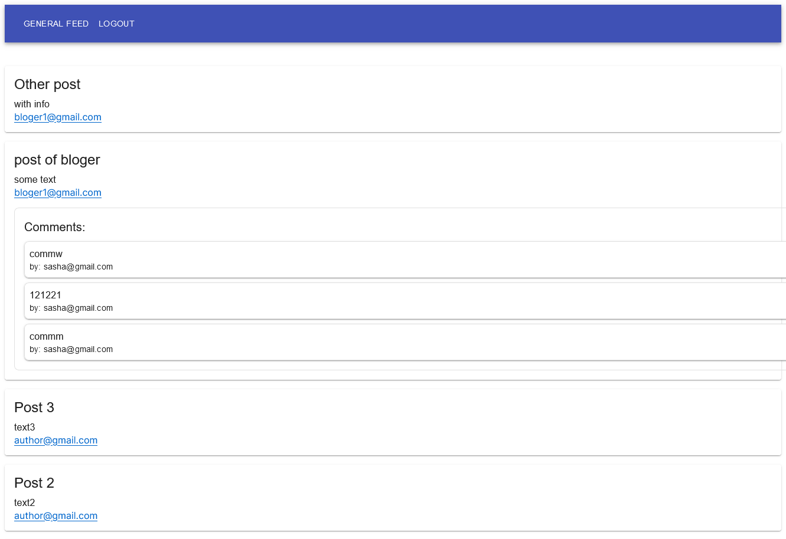

# Mini blog

A training project using NextJS, React, Supabase Auth, Supabase Postgres DB, MaterialUI

Preview here: 
https://mini-blog-jd921qkxh-alina-yermolenko.vercel.app/login

Here's example of what a populated instance looks like:



## Getting Started

First, set up .env file with contents:
```bash
NEXT_PUBLIC_SUPABASE_URL= [public supabase host]
NEXT_PUBLIC_SUPABASE_ANON_KEY= [public supabase token]
```

Then, run the development server:

```bash
npm run dev
# or
yarn dev
# or
pnpm dev
```


Open [http://localhost:3000](http://localhost:3000) with your browser to see the result.
